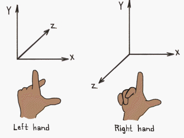

# Girls in IT Initiatives - 2025

- Date: 2025-04-12 (Saturday)
- Time: 10:30am - 02:40pm
- Location: Harbourside 1-2 (CKC 59F)

### Setup Equipment (10:00am - 10:30am, 30 mins)
Equipment:
- Handout
- Raspberry Pi
- Protective Case (2 parts)
- Power Plug + Power Adapter + Power Cable
- Screwdriver + 2x long screws + 6x short screws
- CPU Fan
- Micro SD Card
- HDMI Cable
- Keyboard
- Mouse

### Student Arrival (10:30am - 10:45am, 15 mins)

### Welcome (10:45am - 11:00am)

- Welcoming and Introduction
- Run through of the day

### Ice-Breaking - Volunteer/Students Interaction (11:00am - 11:10am, 10 mins)

- Volunteer introduction

### Introducion to Programming (11:10am - 11:30am, 20 mins)

- What is Raspberry Pi?
- Setup of Raspberry Pi
- Introduce Programming [Game](http://compute-it.toxicode.fr/?hour-of-code)
    - Loops
    - Nested loops
    - If then else
    
### Introduction to Python (11:30am - 12:10am, 40 mins)

- Notebook [Introduction.ipynb](notebook/0_Python_Introduction.ipynb)
- Programming Challenges!

### Lunch Break (1210:am - 01:00pm, 50 mins)

### Introduction to Minecraft (01:00pm - 01:15pm, 15 mins)

- Start the Minecraft Game
    - Menu -> Games -> Minecraft
    - Start Game -> Create New (you can create new worlds till you get one you like)

- 
- Explain the game
- How to navigate in the world with keyboard
    - 
    
    Key | Action 
    --- | ------
    W	| Forward
    A	| Left 
    S	| Backward 
    D	|	Right
    Left-click | Hit
    Right-click | Place block
    Mouse-scroll | Hotbar select
    E	|	Inventory
    Space	|	Jump / Fly up
    Left Shift | Crouch / Fly down
    Double Space	|	Fly / Fall
    Esc	| Pause / Game menu
    Tab	| Release mouse cursor
    
- Minecraft coordinate system:
    - x-axis: East (positive), West (negative)
    - z-axis: South (positive), North (negative)
    - y-axis: High (positive), Low (negative)
    - Right-handed coordinates: thumb = x, index = y, middle = z
    - 

- Building blocks
- Play around the game environment!

### Minecraft Programming (01:15pm - 02:15pm, 60 mins)

- Run through the Notebook [Minrcraft Programming.ipynb](notebook/1_Minecraft_programming.ipynb)
    - Programming: How to navigate in the world, place block with Python API
    - API Documents:
        - Introduction to the Minecraft Python API: http://www.stuffaboutcode.com/2013/04/minecraft-pi-edition-api-tutorial.html
        - API reference: http://www.stuffaboutcode.com/p/minecraft-api-reference.html

- Build a house:
- 
- The Ultimate Challenges: Build a Pyramid!!!
- Write your code to build your own house